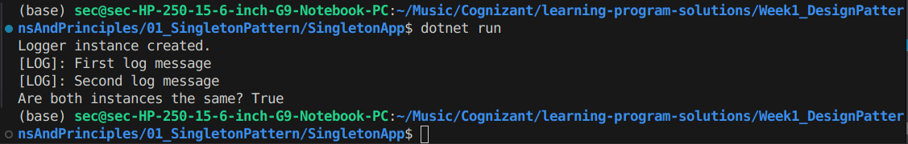

# 🔒 Singleton Pattern – Design Patterns & Principles (C#)

## 📌 What is the Singleton Pattern?

The **Singleton Pattern** ensures that a class has **only one instance** throughout the lifetime of the application — and it provides a **global point of access** to it.

This pattern is part of the **Creational Design Patterns** group.

---

## 🎯 Real-Life Analogy

> Think of an Aadhaar ID — every person has exactly one unique ID. You can't create another one, and everyone refers to the same one.

In software:
- You only want one **Logger**, **Database Connection**, **Config Manager**, etc.
- Creating multiple instances may cause inconsistency or waste resources.

---

## 🧱 How the Code Works

### 🔁 Behind the Scenes (Step-by-Step)

| Step | Code Component | What It Does |
|------|----------------|--------------|
| 1 | `private static Logger _instance;` | Holds the only instance of the class |
| 2 | `private Logger()` | Makes constructor private so no one can `new` it |
| 3 | `public static Logger GetInstance()` | Controls creation; only makes a new one if needed |
| 4 | `Log(string message)` | A sample method to demonstrate functionality |
| 5 | `ReferenceEquals(logger1, logger2)` | Confirms both variables point to the same object |

---

## 🧪 Output Explanation

When you run the program, you see:

✅ This confirms:
- Only **one instance** of `Logger` is created (`Logger instance created.` appears once)
- Both `logger1` and `logger2` use the **same object**
- Your Singleton implementation is **working correctly**

---

## 📌 Summary

- ✅ One instance only
- 🔒 Private constructor
- 🔁 Static access method (`GetInstance()`)
- 🧠 Useful when a **single point of control** is needed (e.g., logging, cache, settings)

---

## 📁 Files in this folder

| File | Description |
|------|-------------|
| `Logger.cs` / `Program.cs` | C# implementation of the Singleton Pattern |
| `Singleton_output.png` | Screenshot of the console output |
| `README.md` | This documentation file |

---

> ✅ Pattern Type: **Creational**  
> 🔧 Use case: Logger, DatabaseConnection, AppConfig, etc.
